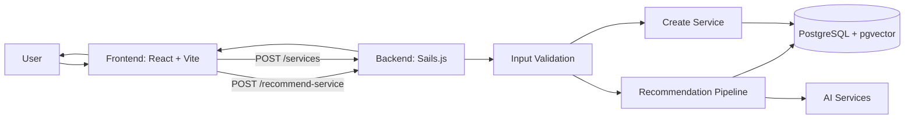
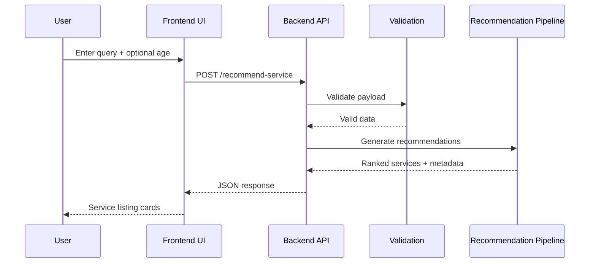

# AI Service Recommendation Engine

Single source documentation for the full project (frontend + backend).

## What This Project Does

This app helps users describe a real-world service need using a query and optional age, then returns a ranked service listing.

It also lets users create new services directly from the frontend.

## Visual Overview



## End-to-End Request Flow



## Project Structure

```text
ai-service-recommendation-engine/
├── backend/        # Sails.js API, helpers, models, routes
├── frontend/       # React UI, forms, API integration
└── README.md       # This combined guide
```

## Core Features

- Query-based service recommendations
- Optional age-aware routing signal
- Service listing with confidence and priority metadata
- Create Service form in UI
- Basic frontend and backend input validation

## Validation Rules (Easy Reference)

### Recommendation Input

- `query` is required in UI, sent as `symptoms` to backend
- Query length: `10` to `8000`
- `patientAge` optional, integer `0` to `150`

### Create Service Input

- `name` required, length `2` to `200`
- `nameAr` optional, if present length `2` to `200`
- `description` required, length `10` to `8000`
- `servingTime` optional, integer `1` to `480`
- `merchantID` required

## API Endpoints Used by Frontend

- `POST /recommend-service`
- `POST /services`

## Quick Start

### 1. Start Backend

```bash
cd backend
npm install
npm start
```

Backend default URL:

- `http://localhost:1337`

### 2. Start Frontend

```bash
cd frontend
npm install
npm run dev
```

Frontend default URL:

- `http://localhost:5173`

## How To Use (In 30 Seconds)

1. Open frontend app.
2. Enter a query and optional age.
3. Click `Get Service Listing`.
4. Review ranked services.
5. Use `Create Service` button to add a new service.

## Troubleshooting

### Frontend Cannot Reach Backend

- Ensure backend is running on `http://localhost:1337`.
- Check `VITE_API_BASE_URL` value.
- Confirm backend route path matches frontend request path.

### Validation Errors

- Review limits in the Validation Rules section.
- Check request payload field names.

## Notes

- Ensure that all environment variables added properly for frontend & backend both
- UI term is `query` for user friendliness.
- Backend compatibility field is `symptoms` in recommendation payload.
